::: {.row}

::: {.content .col-xs-12 .col-sm-8 .col-md-9}

* [Ajout et suppression d'une couche de données vecteur](#I21)
	+ [Par le menu](#I21a)
	+ [Par l'explorateur de fichiers](#I21b)
* [L'interface de QGIS](#I22)
* [Propriétés d'une couche vecteur](#I23)
	+ [Changer la représentation d'une couche](#I23a)
	+ [Connaître l'emplacement d'une couche](#I23b)
	+ [Filtrer les données](#I23c)
* [Ajout d'une couche raster](#I24)
* [Propriétés d'une couche raster : modifier le style](#I25)

## [Ajout et suppression d'une couche de données vecteur](#I21) {#I21}

### [Par le menu](#I21a) {#I21a}

Lancez QGIS. Depuis QGIS 3, il existe une interface unique pour ajouter des couches vecteurs, rasters etc. : le gestionnaire des sources de données.

Pour ajouter une couche vecteur via cette interface, plusieurs solutions au choix :

* [Menu couche → Gestionnaire des sources de données

](#thumb)
* cliquer sur l'icône **Ouvrir le gestionnaire des sources de données**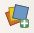
* utiliser le raccourci clavier **ctrl + L** (minuscule)

Si vous souhaitez retrouver vos habitudes de QGIS 2.18, vous pouvez également procéder ainsi : 

* [Menu couche → Ajouter une couche → Ajouter une couche vecteur...

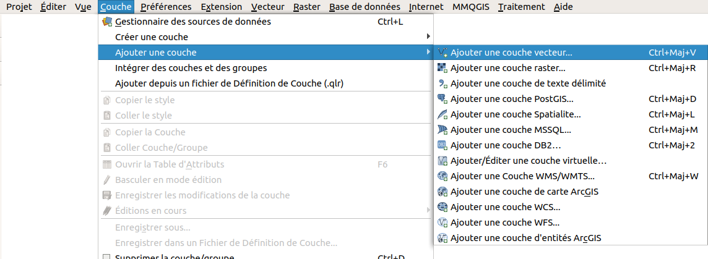](#thumb)
* Cliquer sur l'icône **Ajouter une couche vecteur** (il faut activer la barre d'outils **Gestion des couches** si ce n'est pas déjà fait : menu Vue → Barres d'outils → Gestion des couches)
* utiliser le raccourci clavier **ctrl + majuscule + v**

Dans tous les cas, vous arrivez normalement à cette fenêtre :

[](illustrations/tous/1_2_ajout_couche_vecteur_gestionnaire.png)

* Vérifiez que vous êtes bien dans la rubrique **Vecteur**. Par défaut, le gestionnaire des sources de données s'ouvre dans la dernière rubrique utilisée.
* Type de source et encodage : laissez les valeurs par défaut. Pour en savoir plus sur ce qu'est l'encodage :
 [http://fr.wikipedia.org/wiki/Codage\_de\_caractères](http://fr.wikipedia.org/wiki/Codage_de_caract%C3%A8res)
* Cliquez sur **...** à gauche de **Jeux de données vectorielles** et sélectionnez la couche *[DEPARTEMENT\_BRETAGNE.shp](donnees/TutoQGIS_01_PriseEnMain.zip)* située dans le dossier **TutoQGIS\_01\_PriseEnMain/donnees**.

Cliquez sur **Ajouter** : vous pouvez voir à l'écran les départements de la région Bretagne.

Pour **supprimer cette couche** : clic droit sur son nom dans la table des matières,
 [Supprimer la couche...

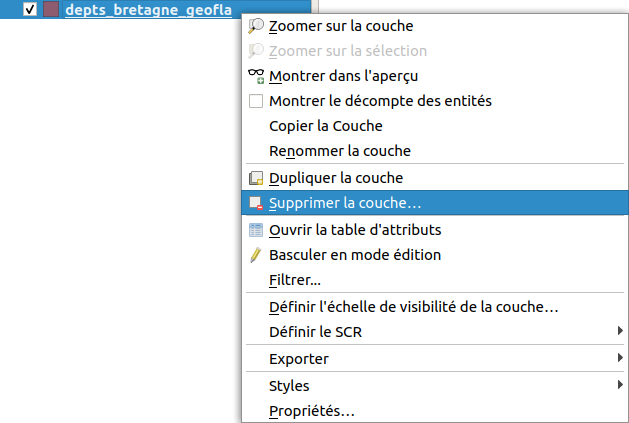](#thumb)

Cette manipulation enlève seulement la couche de QGIS ; elle reste présente sur votre ordinateur, prête à être ajoutée à nouveau dans QGIS.

### [Par l'explorateur de fichiers](#I21b) {#I21b}

Une autre méthode, peut-être plus pratique, consiste à utiliser l'explorateur de fichiers : activez-le éventuellement dans le 
 [Menu Vue → Panneaux → Panneau Explorateur

](#thumb).

Dans ce panneau, naviguez dans l'arborescence de vos fichiers jusqu'au dossier où vous avez téléchargé les données de ce tutoriel. Faites un **clic droit sur ce dossier → Ajouter aux marque-pages**.

A partir des marque-pages, rendez-vous dans le dossier **TutoQGIS\_01\_PriseEnMain/donnees** et double-cliquez sur la couche *DEPARTEMENT\_BRETAGNE.shp*.

[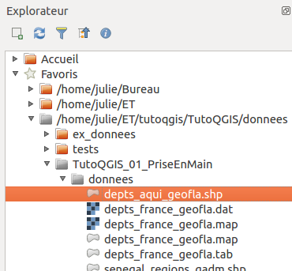](illustrations/tous/1_2_explorateur.png)

## [L'interface de QGIS](#I22) {#I22}

[](illustrations/tous/1_2_interface.png)

On peut distinguer 6 zones dans QGIS :

*1.* **Menus**

*2.* **Barres d'outils**. On y trouve la même chose que dans les menus, mais sous forme d'icônes. Pour savoir que fait un outil, passez la souris au-dessus et lisez l'infobulle. Pour rajouter ou enlever des barres d'outils, clic-droit n'importe où dans cette zone sauf sur un outil désactivé, cocher ou décocher les barres d'outils voulues.

*3.* **Panneau couches**, avec la liste des couches chargées, aussi appelé parfois table des matières ou table of contents (TOC). Si plusieurs couches sont présentes, vous pouvez en modifier ici l'ordre d'affichage en les faisant glisser. Pour faire apparaître ou disparaître cette zone : menu **Vue → Panneaux → Couches**

*4.* **Zone de visualisation**. On peut zoomer ou se déplacer dans cette zone.

*5.* **Panneaux supplémentaires**, par exemple le panneau **Explorateur**. Pour ajouter des panneaux, **Menu Vue → Panneaux**

*6.* **Barre d'état**. On y trouve les coordonnées du point où se trouve la souris, l'échelle...

[](illustrations/tous/1_2_navigation_bo.png)

Testez les différents boutons de zoom et de déplacement.

Pouvez-vous déterminer l'effet de chacun d'entre eux ? A noter : on peut aussi zoomer et dézoomer en utilisant la molette de la souris, ainsi que le trackpad.

Vous pouvez aussi vous déplacer dans la carte (équivalent de l'outil "main") en maintenant la touche espace appuyée, quelque soit l'outil en cours dans QGIS. Le même résultat est obtenu en maintenant la molette de la souris enfoncée (clic molette prolongé).

## [Propriétés d'une couche vecteur](#I23) {#I23}

Pour accéder aux propriétés de la couche, clic-droit sur le nom de la couche dans la table des matières,
 [Propriétés

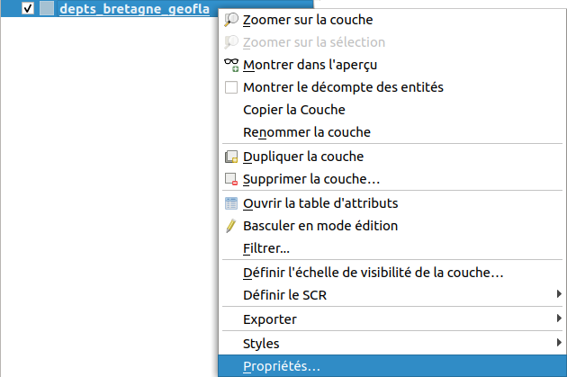](#thumb) 
 (ou bien double-clic sur le nom de la couche).

Vous avez accès ici à plusieurs propriétés, notamment :

1. la manière dont la couche est représentée, dans la rubrique **Symbologie**. Vous pouvez par exemple changer ici la couleur des départements
2. l'emplacement de la couche, dans la rubrique **Information**

### [Changer la représentation d'une couche](#I23a) {#I23a}

Dans les propriétés de la couche, rubrique **Symbologie** :

[](illustrations/tous/1_2_style_couche.png)

Cliquez sur **Remplissage simple**. 

Vous pouvez modifier ici notamment :

*1.* La couleur et le style du remplissage (continu, hachures, pas de remplissage...)

*2.* La couleur et le style de la bordure (ligne continue, pas de bordure, pointillés...)

Essayez de donner à votre couche ces différents styles :

[](illustrations/tous/1_2_style1.png)
[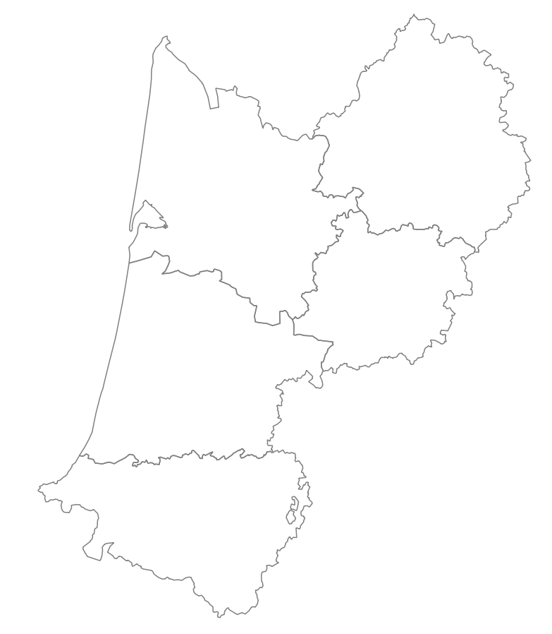](illustrations/tous/1_2_style2.png)
[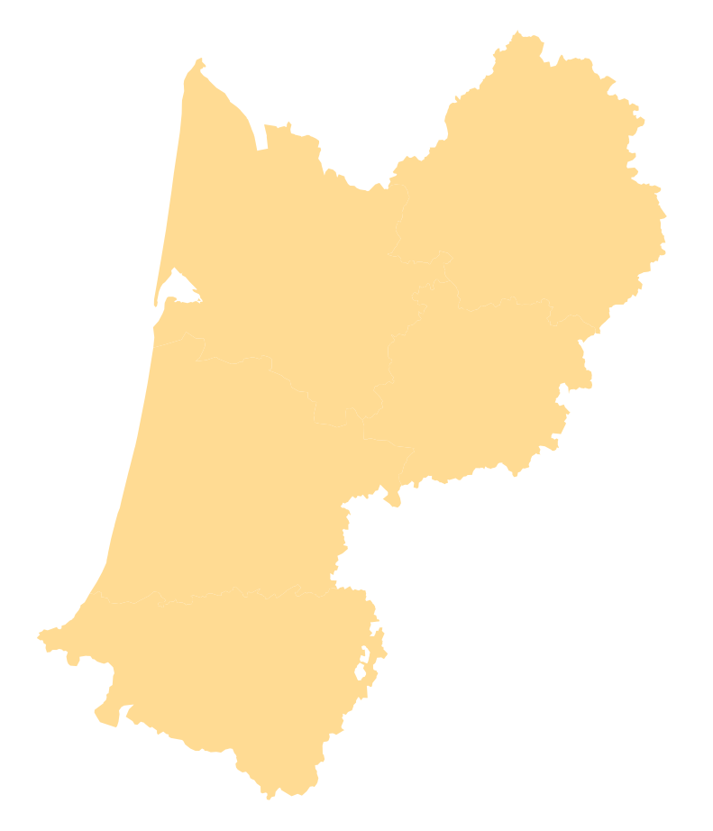](illustrations/tous/1_2_style3.png)

### [Connaître l'emplacement d'une couche](#I23b) {#I23b}

Dans les propriétés de la couche, rubrique **Information** : pouvez-vous dire à quel endroit est stockée la couche *DEPARTEMENT\_BRETAGNE* sur votre ordinateur ?

 La couche est stockée à l'endroit indiqué dans la partie **Chemin**.
 Cet emplacement varie bien sûr en fonction de l'endroit où vous avez enregistré les données du tutoriel.
 [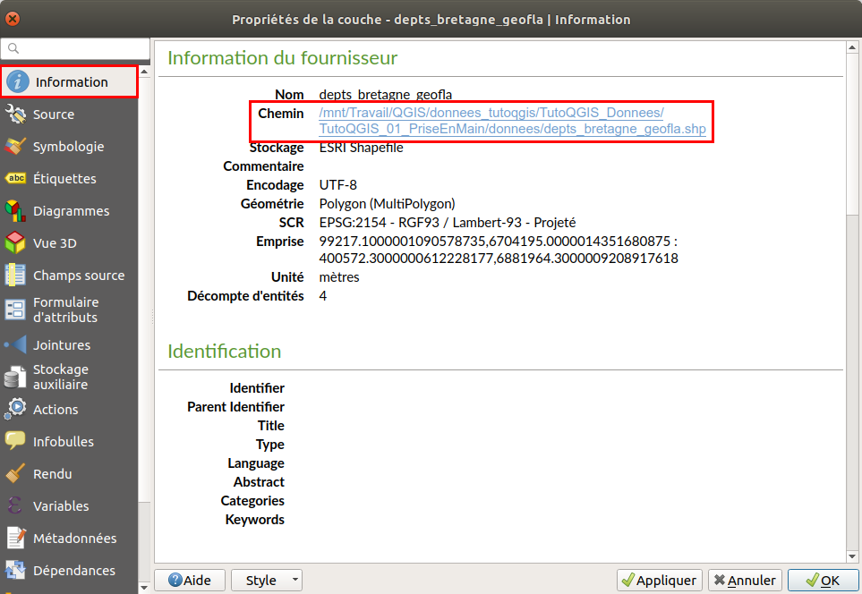](illustrations/tous/1_2_emplacement_couche.png)

Vous pouvez aussi vérifier l'emplacement d'une couche en passant simplement la souris sur son nom dans le panneau des couches !

### [Filtrer les données](#I23c) {#I23c}

Le logiciel offre également la possibilité de de **filtrer les données**. Cette opération ne modifie pas les données elles-mêmes, mais seules les données filtrées seront affichées aussi bien sur la carte que dans la table attributaire. Toutes les opérations effectuées sur la couche ne le seront que sur les données filtrées.

Ceci est très utile pour masquer temporairement certaines données. Si vous souhaitez vraiment ne travailler que sur une partie des données, il est peut-être plus clair de créer une nouvelle couche contenant uniquement les données étudiées.

Ici, nous allons filtrer uniquement le département du Finistère.

Faites un clic droit sur la couche de départements → **Filtrer...**

[](illustrations/tous/1_2_filtrer.png)

Nous allons ici construire une requête simple pour sélectionner le département du Finistère. Les requêtes sont vues plus en détail [ici](06_01_req_attrib.html) !

* Double-cliquez sur le champ **NOM\_DEP** pour le faire apparaître en bas dans l'expression de filtrage
* Cliquez sur l'opérateur **LIKE**
* Cliquez sur le bouton **Toutes** à droite pour voir toutes les valeurs possibles pour le champ NOM\_DEP, puis double-cliquez sur **FINISTERE**

Cliquez ensuite sur le bouton **Tester** : la requête renvoie un résultat. Cliquez sur **OK**.

[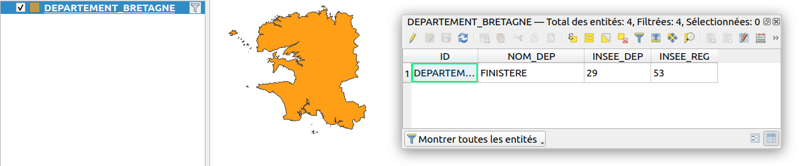](illustrations/tous/1_2_filtrer_resultat.png)

Seul le département du Finistère est visible dans la carte et la couche. Notez qu'un petit entonnoir à droite du nom de la couche indique qu'un filtre est actif.

Filtrer ses données est très pratique, mais le risque est d'oublier qu'on ne travaille pas sur toutes les données !

Pour désactiver le filtre, clic droit sur la couche de départements → **Filtrer...**, cliquer sur **Effacer** puis sur **OK**.

Le filtres est également accessible à partir des propriétés de la couche → rubrique Source → bouton Constructeur de requête tout en bas de la fenêtre.

## [Ajout d'une couche raster](#I24) {#I24}

Comme lors de l'ajout d'une couche vecteur, vous avez plusieurs possibilités pour ajouter une couche raster. Par exemple, en utilisant le **gestionnaire des sources de données :**

* menu couche → Gestionnaire des sources de données
* cliquer sur l'icône du gestionnaire des sources de données
* utiliser le raccourci clavier **ctrl + L**

[](illustrations/tous/1_2_ajout_couche_raster_fenetre.png)

Allez dans la rubrique **Raster** et cliquez sur les **...** à droite de **Jeux de données Raster**.

[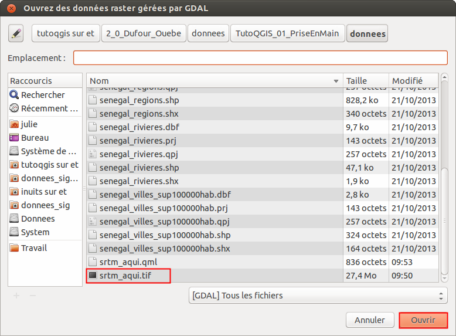](illustrations/tous/1_2_ajout_couche_raster.png)

Rendez-vous dans le dossier **TutoQGIS\_01\_PriseEnMain/donnees** et sélectionnez la couche *[srtm\_bretagne.tif](donnees/TutoQGIS_01_PriseEnMain.zip)*.

Cliquez sur **Ouvrir**, puis sur **Ajouter** dans la fenêtre du gestionnaire de données.

Vous pouvez également double cliquer sur la couche dans l'explorateur de fichiers.

[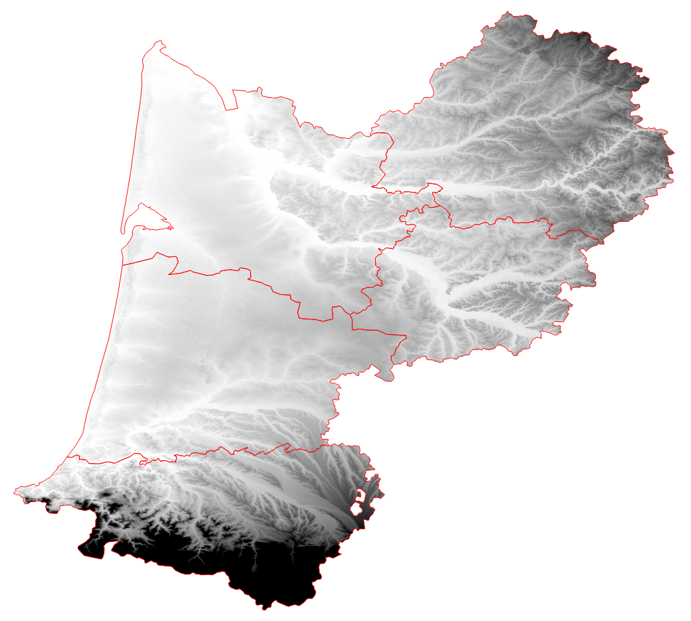](illustrations/tous/1_2_srtm.png)
Pour obtenir cette représentation, la couche de départements est affichée au-dessus du raster, sans remplissage, avec un contour rouge.

Pour modifier l'ordre des couches et donc l'ordre dans lequel elles sont affichée, 
 [faites-les glisser dans la liste des couches

](#thumb).

Il s'agit d'un [modèle d'élévation numérique](http://fr.wikipedia.org/wiki/Mod%C3%A8le_num%C3%A9rique_de_terrain) : chaque pixel possède une valeur correspondant à l'altitude en mètres des éléments présents au sol. Si une forêt est présente, ce sera donc l'altitude du sommet des arbres qui sera mesurée et non l'altitude du sol, idem si des bâtiments sont présents.

Après avoir sélectionné la couche *srtm\_bretagne.tif* en cliquant sur son nom dans la table des matières, utilisez l'outil **Identifier les entités** pour cliquer sur un point du raster et connaître l'altitude de ce point.

[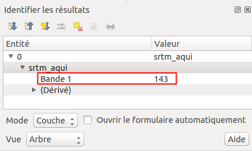](illustrations/tous/1_2_identifier_fenetre.png)

Par exemple, ici, c'est un pixel d'altitude 336 mètres qui a été identifié.

## [Propriétés d'une couche raster : modifier le style](#I25) {#I25}

Comme pour accéder aux propriétés d'une couche vecteur, clic-droit sur le nom de la couche dans la table des matières, **Propriétés** (ou bien double-clic sur le nom de la couche).

Pour une couche raster, les différentes rubriques des propriétés sont un peu différentes de celles d'une couche vecteur ; on retrouve néanmoins les rubriques **Information** et **Symbologie.**

Rendez-vous dans la rubrique **Symbologie** :

[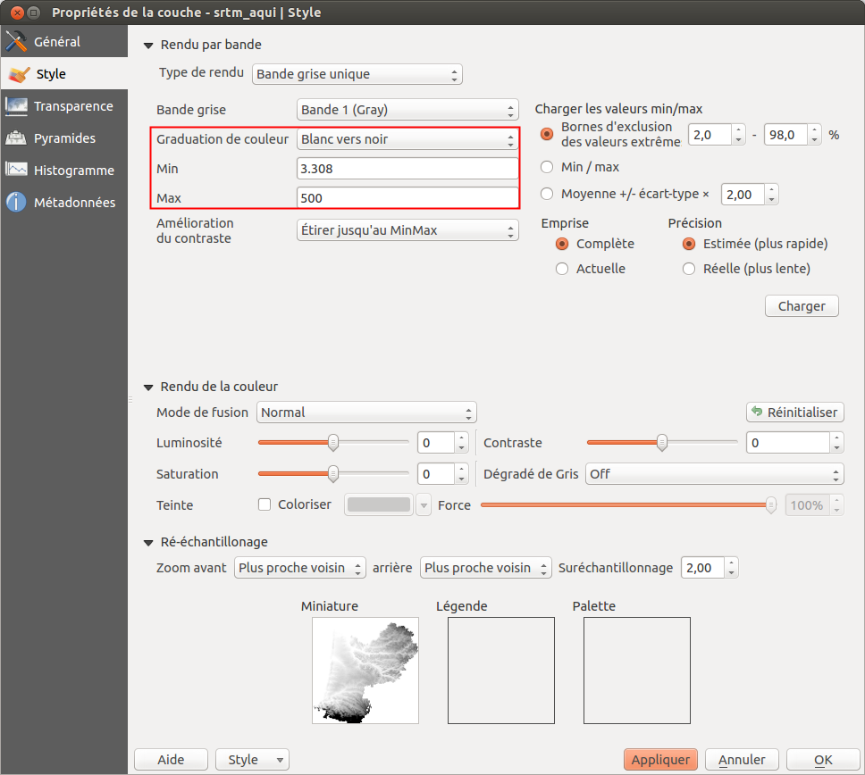](illustrations/tous/1_2_style_raster.png)

Pour ce raster, les valeurs minimum sont représentées en noir et les valeurs maximum en blanc : plus l'altitude est élevée, plus le point est clair.

Vous pouvez modifier les valeurs minimum et maximum, et inverser les couleurs en choisissant **Blanc vers noir** au lieu de **Noir vers blanc**. Cliquez à chaque fois sur **Appliquer** en bas de la fenêtre pour voir le résultat de vos changements.

Il est également possible de faire des classes en fonction des valeurs des pixels, en choisissant le **type de rendu** (en haut de la fenêtre des propriétés rubrique Symbologie) **Pseudo-couleur à bande unique**.

[chapitre précédent](01_01_SIG.html)
[chapitre suivant](01_03_formats.html)

[haut de page](#wrap)

:::

```{r, echo=FALSE}
htmltools::includeHTML("toc01.html")
```

:::

