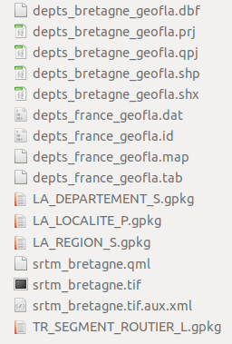
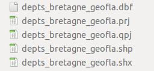
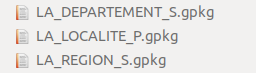
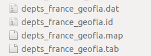

::: {.row}

::: {.content .col-xs-12 .col-sm-8 .col-md-9}

* [Formats vecteur : SHP, GPKG et TAB](#I31)
	+ [Format Shapefile ou SHP : un "standard"](#I31a)
	+ [Format GPKG (GeoPackage)](#I31b)
	+ [Format TAB (MapInfo)](#I31c)
	+ [Et bien d'autres...](#I31d)
* [Un exemple de format raster : le GeoTIFF](#I32)
* [Quel format utiliser parmi tout ça ?](#I33)

Réduire la fenêtre de QGIS. Ouvrir dans l'explorateur de fichiers de votre ordinateur le dossier **TutoQGIS\_01\_PriseEnMain/donnees**

[](illustrations/tous/1_3_fichiers.png)

Si dans Windows, vous ne voyez pas les extensions de tous les fichiers : dans la fenêtre, Outils → Options des dossier, onglet Affichage, décocher la case "Masquer les extensions dont le type est connu".

## [Formats vecteur : SHP, GPKG et TAB](#I31) {#I31}

### [Format Shapefile ou SHP : un "standard"](#I31a) {#I31a}

[](illustrations/tous/1_3_fichiers_shp.png)

La couche *DEPARTEMENT\_BRETAGNE* est au format **shapefile** ou **SHP**.

Le format shapefile a été créé par ESRI, l'auteur notamment du logiciel ArcGIS. Ce format est aujourd'hui l'un des standards du SIG et est couramment utilisé par les logiciels libres de SIG.

**Un fichier SHP est en fait composé de plusieurs fichiers qui fonctionnent ensemble**, dont 3 sont obligatoires :

* **SHP** : contient les informations spatiales
* **DBF** : contient les informations attributaires
* **SHX** : fichier d'index

Deux autres fichiers sont aussi bien utiles :

* **PRJ** : contient le code du système de coordonnées et éventuellement de la projection, lisible par le logiciel ArcGIS
* **QPJ** : contient le code du système de coordonnées et éventuellement de la projection, lisible par le logiciel QGIS

Le fichier QPJ contient plus d'informations que le fichier PRJ ; néanmoins, QGIS crée également un fichier PRJ pour des raisons de compatibilité avec ArcGIS. Si les 2 fichiers sont présents, QGIS utilisera le QPJ.

Pour que le shapefile s'ouvre correctement, tous ces fichiers doivent avoir exactement le même nom. QGIS peut ouvrir et éditer les fichiers SHP.

Outre le fait d'être constitué de plusieurs fichiers, le format Shapefile possède plusieurs limitations : les noms de colonnes sont limités à 10 caractères et doivent éviter les accents (limites dues à l'utilisation du format DBF), la taille est limitée à 2Go... Pour en savoir plus sur ces aspects, et pour connaître des formats alternatifs : [Switch from Shapefile](http://switchfromshapefile.org/).

### [Format GPKG (GeoPackage)](#I31b) {#I31b}

[](illustrations/tous/1_3_fichiers_gpkg.png)

[](illustrations/tous/1_3_fichiers_gpkg_2.png)

Les 4 couches *LA\_DEPARTEMENT*, *LA\_LOCALITE\_P*, *LA\_REGION\_S* et *TR\_SEGMENT\_ROUTIER\_L* sont au format GeoPackage ou GPKG.

Le format **GeoPackage** constitue une alternative au Shapefile. Il est le format par défaut de QGIS depuis la version 3. Il est constitué d'**un seul fichier avec l'extension GPKG**.

Il s'agit en réalité d'une base de données (au format SQLite) et peut donc **contenir plusieurs couches, aussi bien vecteur que raster**.

Ce format léger est implémenté aujourd'hui dans la plupart des logiciels SIG.

Pour en savoir plus : <https://fr.wikipedia.org/wiki/Geopackage> (en français) ou <http://switchfromshapefile.org/#geopackage> (en anglais).

### [Format TAB (MapInfo)](#I31c) {#I31c}

[](illustrations/tous/1_3_fichiers_tab.png)

La couche *DEPARTEMENT* est au format TAB.

Ce format a été créé pour le logiciel **MapInfo**. Comme pour le SHP, un fichier au format **TAB** est en fait composé de **plusieurs fichiers** :

* **MAP** : données spatiales (avec le système de coordonnées)
* **DAT** : données attributaires
* **TAB** : structure de la couche
* **ID** : lien entre les fichiers DAT et MAP
* **IND** : fichier d'indexation (facultatif)

QGIS peut ouvrir et éditer les fichiers au format TAB.

### [Et bien d'autres...](#I31d) {#I31d}

Il existe de nombreux autres formats de fichiers vecteur lisibles par QGIS. Citons par exemple le **GeoJSON**, utilisé notamment pour les cartes interactives en ligne, le **KML**, utilisé par Google Maps et Google Earth...

## [Un exemple de format raster : le GeoTIFF](#I32) {#I32}

[](illustrations/tous/1_3_fichiers_tif.png)

La couche *srtm\_bretagne* est au format TIF.

Vous avez peut-être déjà manipulé des images au format TIF. Les TIF utilisés dans les logiciels SIG possèdent des informations en plus par rapport aux TIF "classiques" : quel type de coordonnées est utilisé, quelles sont les coordonnées de l'image... Il s'agit alors d'un cas particulier de TIF nommé **GeoTIFF**.

L'extension du fichier reste TIF. Cependant, chargé dans un logiciel SIG, ce TIF s'affichera directement au bon endroit ; on dit qu'il est **géoréférencé** (cf. [partie 4 sur le géoréférencement](04_00_georeferencement.html)).

D'autres fichiers peuvent être associés à un raster :

* **QML :** ce fichier facultatif sauvegarde le mode de représentation du raster : du noir vers le blanc, valeur minimum et maximum. S'il n'est pas présent, le raster s'affichera avec des paramètres par défaut. Il est propre à QGIS.
* **AUX.XML :** ce fichier parfois présent sauvegarde des statistiques et parfois le système de coordonnées de l'image. Il permet d'accélérer l'affichage et certains traitements. Ce fichier est également lisible par le logiciel ArcGIS.
* **TFW :** souvent appelé ["World file"](http://fr.wikipedia.org/wiki/World_file), ce fichier stocke les coordonnées de l'image et la taille des pixels. Ce type de fichier existe pour plusieurs formats d'image : l'extension sera JGW pour un JPG, PGW pour un PNG etc. Ce fichier n'est pas nécessaire si les informations sont déjà contenues dans l'en-tête de l'image (ce qui est le cas pour notre GeoTIFF). Les world file sont de moins en moins utilisés dans les SIG ; ils peuvent cependant être utiles pour un logiciel non SIG ou pour un format d'image ne permettant pas le stockage d'informations de localisation dans son en-tête.

## [Quel format utiliser parmi tout ça ?](#I33) {#I33}

La réponse à cette question dépend de plusieurs critères :

* Quels formats utilisent les gens avec qui vous travaillez au quotidien ?
* Quels sont les volumes des données que vous manipulez ?
* S'agit-il de données raster, vecteur ?
* Faites-vous des traitements sur ces données, ou bien les affichez-vous simplement ?

Utiliser le même format que vos collègues simplifie généralement beaucoup les choses.

Dans ce tutoriel, nous utiliserons surtout des données au format GeoPackage, pour les avantages cités plus haut. Cependant, les manipulations sont exactement les mêmes avec des données au format Shapefile ou autre.

[chapitre précédent](01_02_info_geo.html)
[chapitre suivant](01_04_projets.html)

[haut de page](#wrap)

:::

```{r, echo=FALSE}
htmltools::includeHTML("toc01.html")
```

:::

