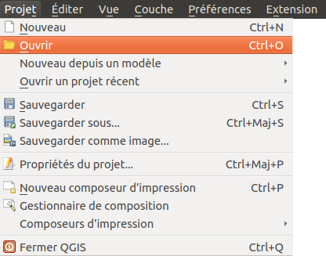

::: {.row}

::: {.content .col-xs-12 .col-sm-8 .col-md-9}

* [Qu'est-ce qu'un projet dans un logiciel SIG ?](#I31)
* [Comment un projet appelle-t-il les données ?](#I32)

## [Qu'est-ce qu'un projet dans un logiciel SIG ?](#I31) {#I31}

Un projet est un espace de travail. Sauvegarder un projet équivaut à sauvegarder le style utilisé pour chaque couche, le zoom... mais pas les données !

**Depuis la version 3 de QGIS, le format par défaut pour les projets est le QGZ et non plus le QGS**. Un fichier QGZ est en fait un fichier QGS plus d'autres informations compressées dans un seul fichier. Il est toujours possible d'ouvrir et d'enregistrer des projets au format QGS.

L'intérêt du format QGZ par rapport au format QGS est de stocker plus d'informations directement dans le projet, par exemple les symboles utilisés, les polices, les rampes de couleurs, les emplacements des étiquettes...


[Ouvrez le projet

](#thumb)
*[senegal.qgz](donnees/TutoQGIS_01_PriseEnMain.zip)* situé dans le dossier **TutoQGIS\_01\_PriseEnMain/projets**. Modifiez le zoom et le style des couches.


 Enregistrez votre projet sous un nouveau nom : clic sur l'icône correspondante, ou bien 
 [Menu Projet → Enregistrer sous...

](#thumb)

Enregistrez votre projet dans le répertoire **TutoQGIS\_01\_PriseEnMain/projets**, sous le nom *senegal\_02.qgz* . Cette opération crée un fichier au format QGZ.

Le fichier QGZ est l'équivalent du WOR sous MapInfo et du MXD sous ArcGIS.

Masquez QGIS, décompressez le fichier QGZ et ouvrez ensuite le fichier QGS au moyen d'un éditeur de texte type bloc-notes : vous pouvez y trouver le chemin des couches chargées dans le projet, la description des couleurs utilisées... Fermez ce fichier.

Il n'est bien sûr pas utile de comprendre en détail le contenu du fichier QGS, mais il est important de noter qu'il ne s'agit que **d'un fichier texte, qui va "appeler" les données**.

**Si vous fournissez à un collègue votre seul fichier QGZ ou QGS, sans les données correspondantes, ce collègue ne pourra pas visualiser les données !**

## [Comment un projet appelle-t-il les données ?](#I32) {#I32}

Le chemin des couches peut être stocké de deux manières dans le projet : 

1. soit **par rapport** à l'emplacement du QGZ ou QGS **(en relatif)**
2. soit **"en dur"**, sous la forme du chemin en entier

1. Par exemple, **../donnees/LA\_LOCALITE\_P.gpkg** signifie qu'il faut remonter d'un dossier par rapport au dossier dans lequel est situé le projet, puis descendre dans le dossier donnees pour y trouver la couche LA\_LOCALITE\_P.gpkg

2. Un exemple de chemin "en dur" : **D:/Travail/SIG/TutoQGIS\_01\_PriseEnMain/donnees/LA\_LOCALITE\_P.gpkg**

Dans QGIS, par défaut **les chemins sont sauvegardés en relatif**, ce qui permet de transmettre à un collègue un dossier avec par exemple un sous-dossier données et un sous-dossier projets.
 Si vous désirez changer ce comportement pour un projet, 
 [Menu Projet → Propriétés... → rubrique Général

](#thumb)
 , changez la propriété **Enregistrer les chemins** de relatif à absolu.

**Si vous déplacez des couches et que vous ouvrez ensuite un projet qui utilise ces couches, vous obtiendrez un message d'erreur : le chemin des couches a changé et ne correspond plus à ce qui est indiqué dans le projet !**

Il sera néanmoins possible de spécifier à nouveau les emplacements des couches du projet.

[chapitre précédent](01_03_formats.html)
[partie II : géodésie](02_00_geodesie.html)

[haut de page](#wrap)

:::

```{r, echo=FALSE}
htmltools::includeHTML("toc01.html")
```

:::

